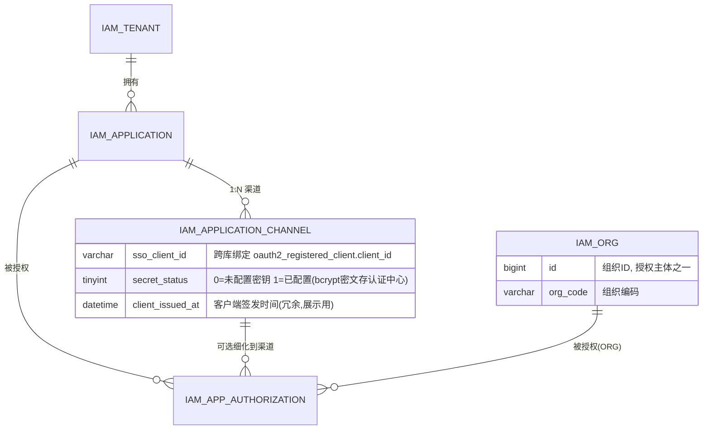

# 应用数据模型设计（资源中心：应用 / 渠道 / 授权）

> 文档版本：V1.5（原型版）
> 更新日期：2026-08-15
> 所属：资源中心（iam-resource-service），数据库 `iam_authorization`
> 关联：`docs/统一认证管理平台设计说明书.md`（21.5 D8 应用目录落地、§12.1.1 库归属）、`docs/改造清单-一级框架.md`（框架项）、`docs/改造清单-二级应用.md`（功能项 B2/B3）
>
> **V1.2 变更**：
> 1. 渠道承载 OAuth2 SSO 客户端绑定（标准 IAM 方案）：渠道既是应用在 Web 门户 / 移动门户的**形态与跳转地址**，也绑定该渠道独立的 OAuth2 客户端（回调地址 / PKCE / 认证方式因端而异）。
> 2. 开放客户端 / 密钥 / API 授权部分**暂记（未定稿）**，移出可执行 DDL，见 §6。
>
> **V1.3 原型范围（定）**：
> - 最小闭环：建 4 表 + 管理接口雏形 + 门户展示接口雏形；**数据膨胀与展示类问题已知暂缓**（客户端分组、consent 聚合、设备 UA 路由均不做）。
> - 保留：渠道挂 `sso_client_id`；渠道 ↔ OAuth2 客户端 ↔ 身份策略的自动联动（本次设计核心，不能省）。
> - 预留但不实现：应用级身份 claim（`app`）、客户端分组、对账任务（见 §10 预警清单）。
>
> **V1.4 变更（渠道 ↔ 客户端密钥关系定版，方案 A）**：
> 1. **密钥零落库**：渠道表**只挂 `sso_client_id`（客户端编码，非敏感）**，明文 `client_secret` 不在资源中心落库——密钥权威在认证中心 `oauth2_registered_client`（仅存 BCrypt 密文），明文仅在**创建 / 重置**时由认证中心**一次性返回**给前端展示，关闭即不可找回。
> 2. 渠道表新增两个辅助列：`secret_status`（TINYINT，0=未配置 1=已配置，供 UI 展示"是否绑定密钥"）、`client_issued_at`（冗余客户端签发时间，便于门户/列表排序展示），均**不承载密钥本身**。
> 3. `sso_client_id` 从"预留"变"定版字段"，与 §4.3 / §5 / §8 DDL 同步。
>
> **V1.5 变更（授权主体补充 ORG）**：
> 1. 新增组织表 `iam_org`（资源中心），`iam_app_authorization.subject_type=ORG` 时 `subject_id` 关联 `iam_org.id`，授权主体三类（USER / ROLE / ORG）一期全支持；组织树维护（人员归属等）仍待补（见 §9）。
> 2. DDL / 种子数据同步：`iam_org` 3 条 demo（集团-部门）+ ORG 授权 demo；SQL 基线升至 V6.5。

---

## 1. 背景与目标

门户工作台需要展示"应用"，并区分 Web / 移动两种访问形态。本模型为资源中心落地以下能力：

| 能力 | 说明 | 状态 |
|------|------|------|
| 租户管理 | 应用归属主体（企业/组织） | ✅ 设计 |
| 应用管理 | 门户展示单元，1 个应用 → N 个渠道 | ✅ 设计 |
| 渠道管理 | 应用在 Web 门户 / 移动门户的形态、跳转地址，及该渠道的 OAuth2 SSO 客户端绑定（含密钥生命周期管理） | ✅ 设计 |
| 应用授权 | 哪些主体可见/可访问哪些应用（粒度到渠道，可空） | ✅ 设计 |
| 开放客户端 / 密钥 / API 授权 | 第三方 B2B 调用平台 API | ⏸ 暂记（未定稿） |

> 核心判断：**渠道是应用的门户形态**（Web 门户 / 移动门户及各自跳转地址），同时**每个渠道绑定独立的 OAuth2 SSO 客户端**——这是标准 IAM 方案，因为不同端点的回调地址、PKCE/认证方式、权限范围各不相同，无法共用同一客户端配置。

---

## 2. 领域模型与关系



> 开放客户端 / 密钥 / API 授权：**暂记**，关系待定，见 §6。

---

## 3. 库归属与边界

```
┌─────────────────────────┐         ┌─────────────────────────┐
│ 认证中心 (iam_identity)  │         │ 资源中心 (iam_authorization) │
│  sys_user / oauth2_*     │         │  sys_user 视图 / sys_role  │
│  iam_tenant (已实现)      │         │  iam_application          │
│  Session/Token → Redis   │         │  iam_application_channel  │
│  (已实现, 不涉及)         │         │  iam_app_authorization    │
└───────────┬─────────────┘         └───────────────┬─────────────┘
            │ 客户端管理 API                         │
            │ (注册/查询 OAuth2 client)              │
            └────────────────────┬────────────────────┘
                  iam_application_channel.sso_client_id
```

- 应用域 3 张业务表（`iam_application` / `iam_application_channel` / `iam_app_authorization`）落在资源中心 `iam_authorization` 库。
- 认证中心（`iam_identity`）的用户 / 租户（`iam_tenant`）/ 客户端 / Session / Token 管理已实现，**本模型不重复建表**。
- 渠道的 `sso_client_id` 是**逻辑引用**（跨库不建外键）：渠道需要 SSO 时，资源中心调用认证中心客户端管理 API 注册 OAuth2 客户端，将返回的 `client_id` 回填渠道；渠道删除时通知认证中心停用/删除客户端。

### 3.1 渠道 ↔ SSO 客户端密钥关系维护（方案 A：密钥零落库）

> **审计口径**：密钥是敏感凭据，**权威与密文只存在于认证中心**；资源中心只持有客户端标识与状态位，任何环节不落明文/可逆密文。

| 数据 | 存放位置 | 备注 |
|------|----------|------|
| `client_id`（`sso_client_id`） | 渠道表 + 认证中心 `oauth2_registered_client` | 非敏感标识，双向可用 |
| 密钥明文 `client_secret` | **不落库** | 仅创建 / 重置时由认证中心生成并**一次性**返回给前端展示 |
| 密钥密文 | 认证中心 `oauth2_registered_client.client_secret` | BCrypt，不可反解 |
| `secret_status` | 渠道表 | 0=未配置 1=已配置，供 UI 判断是否已绑定密钥 |
| `client_issued_at` | 渠道表 | 冗余客户端签发时间，列表/门户排序与展示 |

**生命周期联动**（资源中心调认证中心 `/api/admin/clients`）：

| 动作 | 资源中心（渠道） | 认证中心（客户端） | 密钥处理 |
|------|------------------|--------------------|----------|
| 创建渠道 | 生成 `client_id`（如 `{app_code}-{channel_type}-{shortId}`）→ POST 注册 | 生成随机明文 secret → BCrypt 落库 | 明文随创建响应**一次性**返回展示 |
| 编辑渠道（改跳转地址等） | PUT `/api/admin/clients/{id}`（不带 secret） | 保持原 secret 不变 | — |
| 重置密钥 | POST `/api/admin/clients/{id}/reset-secret` | 生成新明文 → BCrypt 落库 | 明文返回展示；旧密钥即时失效 |
| 删除渠道 | DELETE 渠道记录 + 删除客户端 | `/api/admin/clients/{id}` 清理库 + 缓存 | — |

**一致性边界**：跨服务 CRUD 无分布式事务，以认证中心为基线，资源中心做**幂等补偿**（创建失败/回滚时清理孤儿客户端，见 §10 W5）。

---

## 4. 表设计（数据字典）

> 命名约定：业务表前缀 `iam_`（区别于 RBAC 的 `sys_`）；统一 InnoDB + utf8mb4 + `create_time`/`update_time`。

### 4.1 `iam_tenant` 租户表【已在认证中心落地，资源中心不建】

| 列 | 类型 | 必填 | 说明 |
|----|------|------|------|
| id | bigint PK AI | ✅ | 租户ID |
| tenant_code | varchar(64) UQ | ✅ | 租户编码（如 T001） |
| tenant_name | varchar(100) | ✅ | 租户/企业名称 |
| logo | varchar(500) | ❌ | 租户 LOGO URL |
| description | varchar(500) | ❌ | 描述 |
| contact_name | varchar(100) | ❌ | 联系人 |
| contact_phone | varchar(50) | ❌ | 联系电话 |
| contact_email | varchar(200) | ❌ | 联系邮箱 |
| status | tinyint(1) | ✅ | 1=启用 0=禁用 |
| create_time | datetime | ✅ | 创建时间 |
| update_time | datetime | ✅ | 更新时间 |

> **定版（V1.4）**：`iam_tenant` **已在认证中心落地**（`iam_identity` 库，认证中心租户管理 API 已实现），资源中心**不重复建表**。
> 资源中心各表（`iam_application` / `iam_app_authorization`）仅存 `tenant_id` 数值作**逻辑引用**（跨库不建外键、不做联表 join），门户展示时由 BFF 汇总租户名称。本字典仅作字段约定参考，DDL 见认证中心，不包含在资源中心可执行脚本中。

### 4.2 `iam_application` 应用表（门户展示单元）

| 列 | 类型 | 必填 | 说明 |
|----|------|------|------|
| id | bigint PK AI | ✅ | 应用ID |
| tenant_id | bigint | ✅ | 关联 `iam_tenant.id` |
| app_code | varchar(64) UQ | ✅ | 应用编码（业务唯一，如 OA / CRM） |
| app_name | varchar(100) | ✅ | 应用名称 |
| icon | varchar(500) | ❌ | 应用图标 URL |
| description | varchar(500) | ❌ | 应用描述 |
| sort | int | ✅ | 门户排序（小前大后） |
| visible | tinyint(1) | ✅ | 门户可见性：1=全部可见（无需授权）0=仅授权可见 |
| status | tinyint(1) | ✅ | 1=启用 0=禁用 |
| create_time | datetime | ✅ | 创建时间 |
| update_time | datetime | ✅ | 更新时间 |

> 与 RBAC 的衔接（待确认）：应用启用时可按 `app_code` 自动生成/关联 `sys_permission.code = app:{app_code}`。
> 应用的 OAuth2 SSO 绑定**挂在渠道层**（`iam_application_channel.sso_client_id`，标准 IAM 方案），应用表不承载。

### 4.3 `iam_application_channel` 渠道表（应用 1:N 渠道）

| 列 | 类型 | 必填 | 说明 |
|----|------|------|------|
| id | bigint PK AI | ✅ | 渠道ID |
| app_id | bigint | ✅ | 关联 `iam_application.id` |
| channel_type | varchar(20) | ✅ | 渠道形态：WEB=Web 门户、MOBILE=移动门户（可扩展 H5/MINI） |
| channel_name | varchar(100) | ✅ | 渠道名称（如 "Web 门户"、"移动门户"） |
| access_url | varchar(500) | ✅ | 跳转地址（Web 门户为 PC 端地址，移动门户为移动端地址） |
| sso_client_id | varchar(128) | ❌ | **OAuth2 SSO 客户端**（跨库引用 `oauth2_registered_client.client_id`；API 形态可空） |
| secret_status | tinyint(1) | ✅ | **密钥状态**：0=未配置 1=已配置（密文在认证中心，本列仅走 UI 展示，默认 0） |
| client_issued_at | datetime | ❌ | **客户端签发时间**（冗余认证中心 `client_id_issued_at`，供列表/门户排序展示） |
| is_default | tinyint(1) | ✅ | 默认渠道（同应用仅 1 个=1） |
| sort | int | ✅ | 排序 |
| status | tinyint(1) | ✅ | 1=启用 0=禁用 |
| create_time | datetime | ✅ | 创建时间 |
| update_time | datetime | ✅ | 更新时间 |

> **方案 A — 密钥零落库**：`sso_client_id` 只是客户端标识，**不存密钥**。明文 `client_secret` 仅由认证中心创建/重置时一次性返回展示，资源中心不落库；`secret_status` 反映是否已绑定密钥、`client_issued_at` 冗余签发时间，二者皆非敏感。
> **标准 IAM 方案**：渠道既描述门户形态（Web / 移动及跳转地址），又绑定该渠道独立的 OAuth2 SSO 客户端。不同端点的回调地址、PKCE / 认证方式、授权范围不同，因此每个渠道一个客户端，配置互不影响。

### 4.4 `iam_app_authorization` 应用授权表

| 列 | 类型 | 必填 | 说明 |
|----|------|------|------|
| id | bigint PK AI | ✅ | 授权ID |
| tenant_id | bigint | ✅ | 租户ID |
| app_id | bigint | ✅ | 关联 `iam_application.id` |
| channel_id | bigint | ✅ | **渠道ID，0=整个应用全渠道**；>0=仅该渠道 |
| subject_type | varchar(20) | ✅ | 授权主体类型：ORG=组织 / ROLE=角色 / USER=用户 |
| subject_id | varchar(64) | ✅ | 授权主体ID（**ROLE 存 `sys_role.id`；USER 存业务用户编码 `user_code`**，与平台"内部主键不下放、对外用 user_code"定版一致；ORG 存 `iam_org.id`） |
| status | tinyint(1) | ✅ | 1=有效 0=停用 |
| grant_time | datetime | ✅ | 授权时间 |
| revoke_time | datetime | ❌ | 撤销时间 |
| create_time / update_time | datetime | ✅ | 创建 / 更新时间 |

> 门户可见判定：用户对应用「任意一条有效授权（含 app 级 channel_id=0 与渠道级）」即视为可见；渠道准入 = 有 app 级授权（全渠道）或该渠道级授权。

### 4.5 `iam_org` 组织表（授权主体引用）

| 列 | 类型 | 必填 | 说明 |
|----|------|------|------|
| id | bigint PK AI | ✅ | 组织ID |
| tenant_id | bigint | ✅ | 租户ID（逻辑引用认证中心，非 FK） |
| parent_id | bigint | ✅ | 父组织ID，0=根组织 |
| org_code | varchar(64) | ✅ | 组织编码（业务唯一，如 RND） |
| org_name | varchar(100) | ✅ | 组织名称 |
| org_type | varchar(20) | ✅ | GROUP=集团 / COMPANY=公司 / DEPT=部门 |
| sort / status | int / tinyint(1) | ✅ | 排序 / 1=启用 0=禁用 |
| create_time / update_time | datetime | ✅ | 创建 / 更新时间 |

> 本期职责：作为 `iam_app_authorization.subject_type=ORG` 的主体引用表（原型最小支撑，见 §9 待补：组织树完整维护 / 人员归属）。

### 4.6 `iam_endpoint_policy` 资源接口准入策略表【V6.5 落地】

| 列 | 类型 | 必填 | 说明 |
|----|------|------|------|
| id | bigint PK AI | ✅ | 策略ID |
| domain | varchar(20) | ✅ | 能力域：admin=管理端 / portal=门户 / capability=开放能力 / internal=服务间内部 / permitall=放行(公开) / other=其他 |
| method | varchar(10) | ✅ | HTTP 方法：GET / POST / PUT / DELETE（ANY=全部） |
| path | varchar(255) | ✅ | 路径模式（Spring 注册模式，如 `/api/admin/permissions/{id}`） |
| required_authority | varchar(100) | ✅ | 准入要求：PERMIT_ALL / AUTHENTICATED 任意凭证 / ADMIN_SERVICE_TOKEN 管理服务凭证 / PORTAL_SERVICE_TOKEN 门户服务凭证 / CAPABILITY |
| source | varchar(10) | ✅ | coded=启动扫描默认 / override=管理端覆盖 |
| status / remark | tinyint(1) / varchar(500) | ✅/ | 状态（1=启用 0=禁用）/ 备注 |
| create_time / update_time | datetime | ✅ | 创建 / 更新时间 |

- 唯一约束 `uk_endpoint(method, path)`；索引 `idx_domain`。
- 行数据由启动时按 controller 分包扫描 RequestMapping 自动播种（coded 默认规则），管理端可覆盖；未登记路径默认拒绝。

### 4.7 `iam_api_capability` 开放能力登记表【V6.5 落地】

| 列 | 类型 | 必填 | 说明 |
|----|------|------|------|
| id | bigint PK AI | ✅ | 能力ID |
| tenant_code | varchar(64) | ✅ | 租户编码（逻辑引用认证中心，非 FK） |
| capability_code | varchar(64) | ✅ | 能力编码（业务唯一，如 contact:query） |
| capability_name | varchar(100) | ✅ | 能力名称 |
| method | varchar(10) | ✅ | HTTP 方法 |
| path_pattern | varchar(255) | ✅ | 路径模式（Ant 风格，如 `/api/capability/contacts/{id}`） |
| required_scopes | varchar(255) | | 令牌所需 scope（逗号分隔，空=不限制） |
| owner | varchar(64) | | 归属（产品线/部门） |
| qps_limit | int | ✅ | 全局 QPS 上限（0=不限制；限流计数另表） |
| status / remark | tinyint(1) / varchar(500) | ✅/ | 状态（1=启用 0=停用）/ 备注 |
| create_time / update_time | datetime | ✅ | 创建 / 更新时间 |

- 唯一约束 `uk_capability_code(tenant_code, capability_code)`、`uk_capability_route(method, path_pattern)`。

### 4.8 `iam_capability_subscription` 开放能力订阅表【V6.5 落地】

| 列 | 类型 | 必填 | 说明 |
|----|------|------|------|
| id | bigint PK AI | ✅ | 订阅ID |
| tenant_code | varchar(64) | ✅ | 租户编码（逻辑引用认证中心，非 FK） |
| client_id | varchar(128) | ✅ | 订阅方客户端（逻辑引用 `oauth2_registered_client.client_id`，非 FK） |
| capability_code | varchar(64) | ✅ | 能力编码（逻辑引用 `iam_api_capability.capability_code`） |
| env | varchar(20) | ✅ | PROD=生产 / TEST=测试 |
| qps_limit / quota_daily / quota_monthly | int | ✅ | 订阅 QPS / 每日 / 每月配额（0=不限制）；本期仅登记断言，计数另表 |
| status | tinyint(1) | ✅ | 1=订阅中，0=已取消（软删：revoke_time 记录） |
| subscribe_time / expire_time / revoke_time | datetime | ✅// | 订阅时间 / 到期时间（NULL=长期）/ 取消时间 |
| create_time / update_time | datetime | ✅ | 创建 / 更新时间 |

- 唯一约束 `uk_subscription(tenant_code, client_id, capability_code, env)`。
- 准入语义：能力端点为任意凭证 + 客户端存在有效订阅（status=1 且在有效期内）；与签发侧 `iam_client_policy` 分层（方案 B 命名空间分流，`/api/capability/**` 专属引擎）。

---

## 5. 关键设计决策

1. **应用 1:N 渠道（定版）**：门户展示粒度=应用；渠道=应用在 Web / 移动端的形态与跳转地址差异。
2. **渠道绑定 OAuth2 SSO 客户端（定版）**：渠道表挂 `sso_client_id`；每个渠道独立一个 OAuth2 客户端（回调地址 / PKCE / 认证方式因端而异）。**与 OAuth2 客户端的关系由渠道管理接口联动维护**（建渠道即注册客户端、删渠道即停用），不手工维护。
3. **密钥零落库（方案 A）**：明文 `client_secret` 不落资源中心库；密文（BCrypt）只在认证中心 `oauth2_registered_client.client_secret`；明文仅在创建 / 重置后**一次性展示**。渠道表仅 `sso_client_id` + `secret_status` + `client_issued_at`。**任何业务库不存可反解密钥。**
4. **授权粒度两级并存（channel_id=0 语义）**：`0` 作"全渠道"哨兵值（非 NULL），保证 `uk(tenant_id, app_id, channel_id, subject_type, subject_id)` 唯一约束在 MySQL 下生效。
5. **租户维度**：应用挂 `tenant_id`（逻辑引用认证中心租户，非 FK）；演示环境预置默认租户 T001。

---

## 6. 开放客户端 / 密钥 / API 授权（V6.5 定稿要点）

> 原「暂记」诉求（三方客户端调用服务端 API）于 **V6.5 定稿**：复用认证中心客户端体系（client_id / 令牌），
> 授权粒度走「能力登记 + 订阅」（见 §4.7 / §4.8），不再独立 AppKey/AppSecret 与四表初稿（`iam_open_client` 等已从 DDL 移除）。

- **订阅方身份**：复用 `oauth2_registered_client.client_id`（不绑定独立虚拟账号；令牌经任一生效用户 Bearer + client 归属判定）。
- **授权粒度**：能力级（`iam_api_capability.capability_code`）+ scope 校验（`required_scopes`）+ 订阅（qps/quota 登记断言）。
- 待二期：调用量计数与限流（`iam_capability_usage` 另表）、开发者门户自服务、验签/沙箱环境。
- 原 **方案 A（渠道）**、**密钥零落库**等决策保持不变（§5）。

---

## 7. 种子数据建议

```sql
-- 租户（已在认证中心落地；此处仅作业务引用示例，资源中心不建表/不 INSERT）
-- INSERT INTO iam_tenant (id, tenant_code, tenant_name, status) VALUES (1, 'T001', '演示企业', 1);

-- 应用（与现有 sys_permission 种子 app:portal/app:oa/... 对齐）
INSERT INTO iam_application (tenant_id, app_code, app_name, sort, visible, status) VALUES
(1, 'portal', '门户工作台', 1, 1, 1),
(1, 'oa',     'OA 办公系统', 2, 0, 1),
(1, 'crm',    'CRM 客户管理', 3, 0, 1);

-- 渠道（OA 示例：Web 门户 + 移动门户两种形态，各自跳转地址）
-- sso_client_id / secret_status 由认证中心创建客户端后联动回填；演示留空 secret_status=0 即可
INSERT INTO iam_application_channel (app_id, channel_type, channel_name, access_url, secret_status, is_default, sort, status) VALUES
(2, 'WEB',    'Web 门户',  'http://localhost:8081', 0, 1, 1, 1),
(2, 'MOBILE', '移动门户',  'http://localhost:8082', 0, 0, 2, 1);
```

---

## 8. 附录：DDL（可执行，应用域 3 表 + 组织表；租户表见认证中心）

> 本附录 DDL 已合并进资源中心基线脚本 `iam-resource-service/src/main/resources/iam_authorization.sql`（V6.5，含 demo 样例数据）。如下为同构参考。

```sql
-- ============================================================
-- 资源中心 - 应用域业务表（应用/渠道/授权/组织）
-- 数据库: iam_authorization
-- 归属: iam-resource-service
-- 版本: V1.5（渠道挂 sso_client_id + 密钥零落库；租户表已移至认证中心；授权主体新增 ORG=iam_org.id）
-- ============================================================
USE iam_authorization;
SET NAMES utf8mb4;
SET FOREIGN_KEY_CHECKS = 0;

DROP TABLE IF EXISTS `iam_app_authorization`;
DROP TABLE IF EXISTS `iam_application_channel`;
DROP TABLE IF EXISTS `iam_org`;
DROP TABLE IF EXISTS `iam_application`;

-- ----------------------------
-- 应用表
-- ----------------------------
CREATE TABLE `iam_application`  (
  `id` bigint(0) NOT NULL AUTO_INCREMENT COMMENT '应用ID',
  `tenant_id` bigint(0) NOT NULL COMMENT '租户ID (逻辑引用认证中心 iam_tenant.id, 非FK)',
  `app_code` varchar(64) CHARACTER SET utf8mb4 COLLATE utf8mb4_0900_ai_ci NOT NULL COMMENT '应用编码 (业务唯一, 如 OA)',
  `app_name` varchar(100) CHARACTER SET utf8mb4 COLLATE utf8mb4_0900_ai_ci NOT NULL COMMENT '应用名称',
  `icon` varchar(500) CHARACTER SET utf8mb4 COLLATE utf8mb4_0900_ai_ci NULL DEFAULT NULL COMMENT '应用图标 URL',
  `description` varchar(500) CHARACTER SET utf8mb4 COLLATE utf8mb4_0900_ai_ci NULL DEFAULT NULL COMMENT '应用描述',
  `sort` int(0) NOT NULL DEFAULT 0 COMMENT '门户排序 (小前大后)',
  `visible` tinyint(1) NOT NULL DEFAULT 1 COMMENT '门户可见性: 1=全部可见(无需授权), 0=仅授权可见',
  `status` tinyint(1) NOT NULL DEFAULT 1 COMMENT '状态: 1=启用, 0=禁用',
  `create_time` datetime(0) NOT NULL DEFAULT CURRENT_TIMESTAMP(0) COMMENT '创建时间',
  `update_time` datetime(0) NOT NULL DEFAULT CURRENT_TIMESTAMP(0) ON UPDATE CURRENT_TIMESTAMP(0) COMMENT '更新时间',
  PRIMARY KEY (`id`) USING BTREE,
  UNIQUE INDEX `app_code`(`app_code`) USING BTREE,
  INDEX `idx_tenant`(`tenant_id`) USING BTREE
) ENGINE = InnoDB CHARACTER SET = utf8mb4 COLLATE = utf8mb4_0900_ai_ci COMMENT = '应用表 (门户展示单元)' ROW_FORMAT = Dynamic;

-- ----------------------------
-- 渠道表 (应用 1:N 门户形态, 绑定独立 OAuth2 SSO 客户端)
-- ----------------------------
CREATE TABLE `iam_application_channel`  (
  `id` bigint(0) NOT NULL AUTO_INCREMENT COMMENT '渠道ID',
  `app_id` bigint(0) NOT NULL COMMENT '应用ID (关联 iam_application.id)',
  `channel_type` varchar(20) CHARACTER SET utf8mb4 COLLATE utf8mb4_0900_ai_ci NOT NULL COMMENT '渠道形态: WEB=Web门户, MOBILE=移动门户 (可扩展 H5/MINI)',
  `channel_name` varchar(100) CHARACTER SET utf8mb4 COLLATE utf8mb4_0900_ai_ci NOT NULL COMMENT '渠道名称',
  `access_url` varchar(500) CHARACTER SET utf8mb4 COLLATE utf8mb4_0900_ai_ci NOT NULL COMMENT '跳转地址 (Web/移动端各自地址)',
  `sso_client_id` varchar(128) CHARACTER SET utf8mb4 COLLATE utf8mb4_0900_ai_ci NULL DEFAULT NULL COMMENT 'OAuth2 SSO 客户端 (逻辑引用认证中心 oauth2_registered_client.client_id)',
  `secret_status` tinyint(1) NOT NULL DEFAULT 0 COMMENT '密钥状态: 0=未配置, 1=已配置 (仅走UI展示; 密文存认证中心)',
  `client_issued_at` datetime(0) NULL DEFAULT NULL COMMENT '客户端签发时间 (冗余认证中心 client_id_issued_at)',
  `is_default` tinyint(1) NOT NULL DEFAULT 0 COMMENT '默认渠道: 1=是 (同应用仅一个), 0=否',
  `sort` int(0) NOT NULL DEFAULT 0 COMMENT '排序',
  `status` tinyint(1) NOT NULL DEFAULT 1 COMMENT '状态: 1=启用, 0=禁用',
  `create_time` datetime(0) NOT NULL DEFAULT CURRENT_TIMESTAMP(0) COMMENT '创建时间',
  `update_time` datetime(0) NOT NULL DEFAULT CURRENT_TIMESTAMP(0) ON UPDATE CURRENT_TIMESTAMP(0) COMMENT '更新时间',
  PRIMARY KEY (`id`) USING BTREE,
  UNIQUE INDEX `uk_sso_client`(`sso_client_id`) USING BTREE,
  INDEX `idx_app`(`app_id`) USING BTREE
) ENGINE = InnoDB CHARACTER SET = utf8mb4 COLLATE = utf8mb4_0900_ai_ci COMMENT = '应用渠道表 (门户形态 + SSO 客户端绑定)' ROW_FORMAT = Dynamic;

-- ----------------------------
-- 组织表 (应用授权主体: ORG=iam_org.id)
-- ----------------------------
CREATE TABLE `iam_org`  (
  `id` bigint(0) NOT NULL AUTO_INCREMENT COMMENT '组织ID',
  `tenant_id` bigint(0) NOT NULL COMMENT '租户ID (逻辑引用认证中心 iam_tenant.id, 非FK)',
  `parent_id` bigint(0) NOT NULL DEFAULT 0 COMMENT '父组织ID: 0=根组织',
  `org_code` varchar(64) CHARACTER SET utf8mb4 COLLATE utf8mb4_0900_ai_ci NOT NULL COMMENT '组织编码 (业务唯一, 如 RND)',
  `org_name` varchar(100) CHARACTER SET utf8mb4 COLLATE utf8mb4_0900_ai_ci NOT NULL COMMENT '组织名称',
  `org_type` varchar(20) CHARACTER SET utf8mb4 COLLATE utf8mb4_0900_ai_ci NOT NULL DEFAULT 'DEPT' COMMENT '组织类型: GROUP=集团/COMPANY=公司/DEPT=部门',
  `sort` int(0) NOT NULL DEFAULT 0 COMMENT '排序 (小前大后)',
  `status` tinyint(1) NOT NULL DEFAULT 1 COMMENT '状态: 1=启用, 0=禁用',
  `create_time` datetime(0) NOT NULL DEFAULT CURRENT_TIMESTAMP(0) COMMENT '创建时间',
  `update_time` datetime(0) NOT NULL DEFAULT CURRENT_TIMESTAMP(0) ON UPDATE CURRENT_TIMESTAMP(0) COMMENT '更新时间',
  PRIMARY KEY (`id`) USING BTREE,
  UNIQUE INDEX `uk_org_code`(`org_code`) USING BTREE,
  INDEX `idx_parent`(`parent_id`) USING BTREE,
  INDEX `idx_tenant`(`tenant_id`) USING BTREE
) ENGINE = InnoDB CHARACTER SET = utf8mb4 COLLATE = utf8mb4_0900_ai_ci COMMENT = '组织表 (应用授权主体: ORG=iam_org.id)' ROW_FORMAT = Dynamic;

-- ----------------------------
-- 应用授权表
-- ----------------------------
CREATE TABLE `iam_app_authorization`  (
  `id` bigint(0) NOT NULL AUTO_INCREMENT COMMENT '授权ID',
  `tenant_id` bigint(0) NOT NULL COMMENT '租户ID',
  `app_id` bigint(0) NOT NULL COMMENT '应用ID (关联 iam_application.id)',
  `channel_id` bigint(0) NOT NULL DEFAULT 0 COMMENT '渠道ID: 0=整个应用全渠道, >0=仅该渠道',
  `subject_type` varchar(20) CHARACTER SET utf8mb4 COLLATE utf8mb4_0900_ai_ci NOT NULL COMMENT '授权主体类型: ORG=组织/ROLE=角色/USER=用户',
  `subject_id` varchar(64) CHARACTER SET utf8mb4 COLLATE utf8mb4_0900_ai_ci NOT NULL COMMENT '授权主体ID (ROLE=sys_role.id; USER=业务用户编码 user_code; ORG=iam_org.id)',
  `status` tinyint(1) NOT NULL DEFAULT 1 COMMENT '状态: 1=有效, 0=停用',
  `grant_time` datetime(0) NOT NULL DEFAULT CURRENT_TIMESTAMP(0) COMMENT '授权时间',
  `revoke_time` datetime(0) NULL DEFAULT NULL COMMENT '撤销时间',
  `create_time` datetime(0) NOT NULL DEFAULT CURRENT_TIMESTAMP(0) COMMENT '创建时间',
  `update_time` datetime(0) NOT NULL DEFAULT CURRENT_TIMESTAMP(0) ON UPDATE CURRENT_TIMESTAMP(0) COMMENT '更新时间',
  PRIMARY KEY (`id`) USING BTREE,
  UNIQUE INDEX `uk_authz`(`tenant_id`, `app_id`, `channel_id`, `subject_type`, `subject_id`) USING BTREE,
  INDEX `idx_subject`(`subject_type`, `subject_id`) USING BTREE
) ENGINE = InnoDB CHARACTER SET = utf8mb4 COLLATE = utf8mb4_0900_ai_ci COMMENT = '应用授权表' ROW_FORMAT = Dynamic;

-- ----------------------------
-- 种子数据
-- ----------------------------
-- 租户: 已在认证中心建好 T001(1), 此处不重复 INSERT
INSERT INTO `iam_application` (id, tenant_id, app_code, app_name, sort, visible, status) VALUES
(1, 1, 'portal', '门户工作台', 1, 1, 1),
(2, 1, 'oa',     'OA 办公系统', 2, 0, 1),
(3, 1, 'crm',    'CRM 客户管理', 3, 0, 1);
INSERT INTO `iam_application_channel` (app_id, channel_type, channel_name, access_url, secret_status, is_default, sort, status) VALUES
(2, 'WEB',    'Web 门户', 'http://localhost:8081', 0, 1, 1, 1),
(2, 'MOBILE', '移动门户', 'http://localhost:8082', 0, 0, 2, 1);
INSERT INTO `iam_org` (tenant_id, parent_id, org_code, org_name, org_type, sort, status) VALUES
(1, 0, 'HQ',    '集团总部', 'GROUP', 1, 1),
(1, 1, 'RND',   '研发部',   'DEPT',  1, 1),
(1, 1, 'SALES', '销售部',   'DEPT',  2, 1);
INSERT INTO `iam_app_authorization` (tenant_id, app_id, channel_id, subject_type, subject_id, status) VALUES
(1, 2, 0, 'ROLE', '1', 1),
(1, 3, 0, 'ORG',  '2', 1);

SET FOREIGN_KEY_CHECKS = 1;
```

---

## 9. 待确认事项

1. ~~`iam_app_authorization.subject_type` 的 ORG 依赖组织表~~ —— **已补充**：一期新增 `iam_org`（资源中心），ORG 授权 `subject_id=iam_org.id`，支持 USER / ROLE / ORG 三类主体。**待补**：组织树的完整维护（增删改查 / 移动 / 人员归属），原型仅承载授权主体引用。
2. 应用授权与现有 RBAC `sys_permission(app:xxx)` 的落库衔接（自动生成权限 vs 完全解耦）——**暂缓**，原型先解耦。
3. 开放客户端方案定稿后再补 §6 的表设计与 DDL（**暂记**）。

---

## 10. 预警清单（原型不实现，但必须记住，避免架构走偏）

> 以下为设计层面的提前预警，原型阶段不落地，但实施过程中不得违背，否则后期返工成本高。

| # | 预警 | 说明 | 触发时机 |
|---|------|------|----------|
| W1 | **令牌应用身份 vs 渠道客户端解耦** | 渠道各自有客户端 → token 的 `client_id` 是渠道而非应用。下游鉴权不能以 `client_id` 当"应用"用，后续要加 `app` claim / `aud=应用编码` | 做资源中心鉴权/门户接口时 |
| W2 | **渠道 ↔ SSO 客户端联动（定稿，不含身份策略）** | 建渠道即注册客户端（含密钥一次性返回）、删渠道即停用。退化成手工维护=漂移点。**本次原型不做客户端身份策略表**，客户端默认放行；若未来有"按渠道限制身份类型"诉求再引入 | 渠道管理接口开发时（核心） |
| W3 | **授权(应用)与认证(渠道)分层** | 谁能看应用 = `iam_app_authorization`（应用层）；怎么登入 = 渠道客户端（传输层）。两层勿混淆 | 门户接口返回渠道时 |
| W4 | **渠道客户端默认放行身份类型** | 渠道注册的客户端未配身份策略 → 默认放行全部身份类型（符合 C 端门户预期）；密钥零落库方案下客户端认证方式固定 `client_secret_basic` + PKCE（`secret_status=1` 时可用） | 配置 C 端/管理端差异时 |
| W5 | **跨服务生命周期一致性** | 渠道建在资源中心、客户端在认证中心，跨服务 CRUD 需幂等 + 失败补偿，最终对账 | 渠道管理接口开发时 |

*文档版本：V1.5 原型版 | 关联 D8（应用目录二期） | 范围：应用域 3 表 + 组织表 iam_org（渠道挂 SSO 客户端 + 密钥零落库） + 管理/门户接口雏形*
