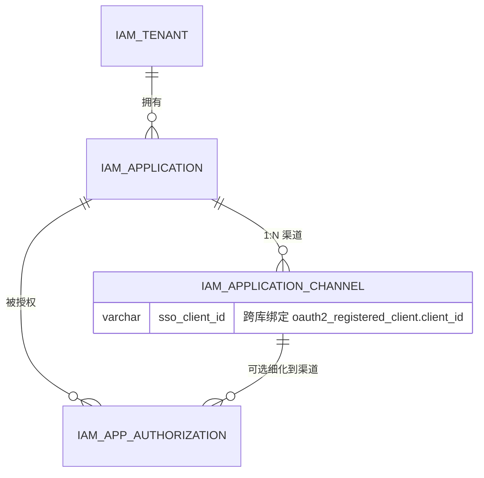

# 应用数据模型设计（资源中心：应用 / 渠道 / 授权）

> 文档版本：V1.3（原型版）
> 更新日期：2026-08-15
> 所属：资源中心（iam-resource-service），数据库 `iam_authorization`
> 关联：`docs/统一认证管理平台设计说明书.md`（D8 应用目录二期、§12.1.1 库归属）、`docs/改造清单.md`
>
> **V1.2 变更**：
> 1. 渠道承载 OAuth2 SSO 客户端绑定（标准 IAM 方案）：渠道既是应用在 Web 门户 / 移动门户的**形态与跳转地址**，也绑定该渠道独立的 OAuth2 客户端（回调地址 / PKCE / 认证方式因端而异）。
> 2. 开放客户端 / 密钥 / API 授权部分**暂记（未定稿）**，移出可执行 DDL，见 §6。
>
> **V1.3 原型范围（定）**：
> - 最小闭环：建 4 表 + 管理接口雏形 + 门户展示接口雏形；**数据膨胀与展示类问题已知暂缓**（客户端分组、consent 聚合、设备 UA 路由均不做）。
> - 保留：渠道挂 `sso_client_id`；渠道 ↔ OAuth2 客户端 ↔ 身份策略的自动联动（本次设计核心，不能省）。
> - 预留但不实现：应用级身份 claim（`app`）、客户端分组、对账任务（见 §10 预警清单）。

---

## 1. 背景与目标

门户工作台需要展示"应用"，并区分 Web / 移动两种访问形态。本模型为资源中心落地以下能力：

| 能力 | 说明 | 状态 |
|------|------|------|
| 租户管理 | 应用归属主体（企业/组织） | ✅ 设计 |
| 应用管理 | 门户展示单元，1 个应用 → N 个渠道 | ✅ 设计 |
| 渠道管理 | 应用在 Web 门户 / 移动门户的形态、跳转地址，及该渠道的 OAuth2 SSO 客户端绑定 | ✅ 设计 |
| 应用授权 | 哪些主体可见/可访问哪些应用（粒度到渠道，可空） | ✅ 设计 |
| 开放客户端 / 密钥 / API 授权 | 第三方 B2B 调用平台 API | ⏸ 暂记（未定稿） |

> 核心判断：**渠道是应用的门户形态**（Web 门户 / 移动门户及各自跳转地址），同时**每个渠道绑定独立的 OAuth2 SSO 客户端**——这是标准 IAM 方案，因为不同端点的回调地址、PKCE/认证方式、权限范围各不相同，无法共用同一客户端配置。

---

## 2. 领域模型与关系



> 开放客户端 / 密钥 / API 授权：**暂记**，关系待定，见 §6。

---

## 3. 库归属与边界

```
┌─────────────────────────┐         ┌─────────────────────────┐
│ 认证中心 (iam_identity)  │         │ 资源中心 (iam_authorization) │
│  sys_user / oauth2_*     │         │  sys_user / sys_role / ... (RBAC) │
│  Session/Token → Redis   │         │  iam_tenant / iam_application  │
│  (已实现, 不涉及)         │         │  iam_application_channel      │
└───────────┬─────────────┘         │  iam_app_authorization        │
            │ 客户端管理 API          └───────────────┬─────────────┘
            │ (注册/查询 OAuth2 client)                │
            └────────────────────┬────────────────────┘
                  iam_application_channel.sso_client_id
```

- 全部表落在资源中心 `iam_authorization` 库。
- 认证中心（`iam_identity`）的用户 / 客户端 / Session / Token 管理已实现，**本模型不涉及**。
- 渠道的 `sso_client_id` 是**逻辑引用**（跨库不建外键）：渠道需要 SSO 时，资源中心调用认证中心客户端管理 API 注册 OAuth2 客户端，将返回的 `client_id` 回填渠道；渠道删除时通知认证中心停用/删除客户端。

---

## 4. 表设计（数据字典）

> 命名约定：业务表前缀 `iam_`（区别于 RBAC 的 `sys_`）；统一 InnoDB + utf8mb4 + `create_time`/`update_time`。

### 4.1 `iam_tenant` 租户表

| 列 | 类型 | 必填 | 说明 |
|----|------|------|------|
| id | bigint PK AI | ✅ | 租户ID |
| tenant_code | varchar(64) UQ | ✅ | 租户编码（如 T001） |
| tenant_name | varchar(100) | ✅ | 租户/企业名称 |
| logo | varchar(500) | ❌ | 租户 LOGO URL |
| description | varchar(500) | ❌ | 描述 |
| contact_name | varchar(100) | ❌ | 联系人 |
| contact_phone | varchar(50) | ❌ | 联系电话 |
| contact_email | varchar(200) | ❌ | 联系邮箱 |
| status | tinyint(1) | ✅ | 1=启用 0=禁用 |
| create_time | datetime | ✅ | 创建时间 |
| update_time | datetime | ✅ | 更新时间 |

### 4.2 `iam_application` 应用表（门户展示单元）

| 列 | 类型 | 必填 | 说明 |
|----|------|------|------|
| id | bigint PK AI | ✅ | 应用ID |
| tenant_id | bigint | ✅ | 关联 `iam_tenant.id` |
| app_code | varchar(64) UQ | ✅ | 应用编码（业务唯一，如 OA / CRM） |
| app_name | varchar(100) | ✅ | 应用名称 |
| icon | varchar(500) | ❌ | 应用图标 URL |
| description | varchar(500) | ❌ | 应用描述 |
| sort | int | ✅ | 门户排序（小前大后） |
| visible | tinyint(1) | ✅ | 门户可见性：1=全部可见（无需授权）0=仅授权可见 |
| status | tinyint(1) | ✅ | 1=启用 0=禁用 |
| create_time | datetime | ✅ | 创建时间 |
| update_time | datetime | ✅ | 更新时间 |

> 与 RBAC 的衔接（待确认）：应用启用时可按 `app_code` 自动生成/关联 `sys_permission.code = app:{app_code}`。
> 应用的 OAuth2 SSO 绑定**挂在渠道层**（`iam_application_channel.sso_client_id`，标准 IAM 方案），应用表不承载。

### 4.3 `iam_application_channel` 渠道表（应用 1:N 渠道）

| 列 | 类型 | 必填 | 说明 |
|----|------|------|------|
| id | bigint PK AI | ✅ | 渠道ID |
| app_id | bigint | ✅ | 关联 `iam_application.id` |
| channel_type | varchar(20) | ✅ | 渠道形态：WEB=Web 门户、MOBILE=移动门户（可扩展 H5/MINI） |
| channel_name | varchar(100) | ✅ | 渠道名称（如 "Web 门户"、"移动门户"） |
| access_url | varchar(500) | ✅ | 跳转地址（Web 门户为 PC 端地址，移动门户为移动端地址） |
| sso_client_id | varchar(100) | ❌ | **OAuth2 SSO 客户端**（跨库引用 `oauth2_registered_client.client_id`；API 形态可空） |
| is_default | tinyint(1) | ✅ | 默认渠道（同应用仅 1 个=1） |
| sort | int | ✅ | 排序 |
| status | tinyint(1) | ✅ | 1=启用 0=禁用 |
| create_time | datetime | ✅ | 创建时间 |
| update_time | datetime | ✅ | 更新时间 |

> **标准 IAM 方案**：渠道既描述门户形态（Web / 移动及跳转地址），又绑定该渠道独立的 OAuth2 SSO 客户端。不同端点的回调地址、PKCE / 认证方式、授权范围不同，因此每个渠道一个客户端，配置互不影响。

### 4.4 `iam_app_authorization` 应用授权表

| 列 | 类型 | 必填 | 说明 |
|----|------|------|------|
| id | bigint PK AI | ✅ | 授权ID |
| tenant_id | bigint | ✅ | 租户ID |
| app_id | bigint | ✅ | 关联 `iam_application.id` |
| channel_id | bigint | ✅ | **渠道ID，0=整个应用全渠道**；>0=仅该渠道 |
| subject_type | varchar(20) | ✅ | 授权主体类型：ORG=组织 / ROLE=角色 / USER=用户 |
| subject_id | bigint | ✅ | 授权主体ID（ORG 关联二期 `iam_org`；ROLE 关联 `sys_role.id`；USER 关联 `sys_user.id`） |
| status | tinyint(1) | ✅ | 1=有效 0=停用 |
| grant_time | datetime | ✅ | 授权时间 |
| revoke_time | datetime | ❌ | 撤销时间 |
| create_time / update_time | datetime | ✅ | 创建 / 更新时间 |

> 门户可见判定：用户对应用「任意一条有效授权（含 app 级 channel_id=0 与渠道级）」即视为可见；渠道准入 = 有 app 级授权（全渠道）或该渠道级授权。

---

## 5. 关键设计决策

1. **应用 1:N 渠道（定版）**：门户展示粒度=应用；渠道=应用在 Web / 移动端的形态与跳转地址差异。
2. **渠道与 OAuth2 解耦**：渠道表无 `client_id`；应用与 OAuth2 客户端的 SSO 绑定为独立事项，未定稿。
3. **授权粒度两级并存（channel_id=0 语义）**：`0` 作"全渠道"哨兵值（非 NULL），保证 `uk(tenant_id, app_id, channel_id, subject_type, subject_id)` 唯一约束在 MySQL 下生效。
4. **租户维度**：应用挂 `tenant_id`；演示环境预置默认租户 T001。

---

## 6. 暂记：开放客户端 / 密钥 / API 授权（未定稿）

> ⏸ 以下仅记录诉求，未完成设计，**暂不落库 / 不实现**，待开放接入方案定稿后再设计表结构。

- **诉求来源**（`docs/备忘.md`）：三方客户端通过提供的密钥调用服务端 API（如拉取组织通讯录和人员数据）。
- **原 V1.0 初稿**：`iam_open_client` / `iam_secret`（AppKey/AppSecret 轮换）/ `iam_open_api` / `iam_api_authorization` 四表，已从可执行 DDL 中移除。
- **待定问题**：
  1. 开放客户端是否需要独立密钥体系（AppKey/AppSecret 验签），还是复用认证中心 `client_credentials` 令牌？
  2. 调用身份主体：绑定平台用户 vs 独立虚拟账号？
  3. API 授权粒度：API 级 / 接口级 / 数据范围（scope）？

---

## 7. 种子数据建议

```sql
-- 租户
INSERT INTO iam_tenant (id, tenant_code, tenant_name, status) VALUES (1, 'T001', '演示企业', 1);

-- 应用（与现有 sys_permission 种子 app:portal/app:oa/... 对齐）
INSERT INTO iam_application (tenant_id, app_code, app_name, sort, visible, status) VALUES
(1, 'portal', '门户工作台', 1, 1, 1),
(1, 'oa',     'OA 办公系统', 2, 0, 1),
(1, 'crm',    'CRM 客户管理', 3, 0, 1);

-- 渠道（OA 示例：Web 门户 + 移动门户两种形态，各自跳转地址）
INSERT INTO iam_application_channel (app_id, channel_type, channel_name, access_url, is_default, sort, status) VALUES
(2, 'WEB',    'Web 门户', 'http://localhost:8081', 1, 1, 1),
(2, 'MOBILE', '移动门户', 'http://localhost:8082', 0, 2, 1);
```

---

## 8. 附录：DDL（可执行，仅已定稿 4 表）

```sql
-- ============================================================
-- 资源中心 - 应用域业务表（租户/应用/渠道/授权）
-- 数据库: iam_authorization
-- 归属: iam-resource-service
-- 版本: V1.1（渠道与 OAuth2 解耦；开放客户端部分暂记未含）
-- ============================================================
USE iam_authorization;
SET NAMES utf8mb4;
SET FOREIGN_KEY_CHECKS = 0;

DROP TABLE IF EXISTS `iam_app_authorization`;
DROP TABLE IF EXISTS `iam_application_channel`;
DROP TABLE IF EXISTS `iam_application`;
DROP TABLE IF EXISTS `iam_tenant`;

-- ----------------------------
-- 租户表
-- ----------------------------
CREATE TABLE `iam_tenant`  (
  `id` bigint(0) NOT NULL AUTO_INCREMENT COMMENT '租户ID',
  `tenant_code` varchar(64) CHARACTER SET utf8mb4 COLLATE utf8mb4_0900_ai_ci NOT NULL COMMENT '租户编码',
  `tenant_name` varchar(100) CHARACTER SET utf8mb4 COLLATE utf8mb4_0900_ai_ci NOT NULL COMMENT '租户/企业名称',
  `logo` varchar(500) CHARACTER SET utf8mb4 COLLATE utf8mb4_0900_ai_ci NULL DEFAULT NULL COMMENT '租户 LOGO URL',
  `description` varchar(500) CHARACTER SET utf8mb4 COLLATE utf8mb4_0900_ai_ci NULL DEFAULT NULL COMMENT '描述',
  `contact_name` varchar(100) CHARACTER SET utf8mb4 COLLATE utf8mb4_0900_ai_ci NULL DEFAULT NULL COMMENT '联系人',
  `contact_phone` varchar(50) CHARACTER SET utf8mb4 COLLATE utf8mb4_0900_ai_ci NULL DEFAULT NULL COMMENT '联系电话',
  `contact_email` varchar(200) CHARACTER SET utf8mb4 COLLATE utf8mb4_0900_ai_ci NULL DEFAULT NULL COMMENT '联系邮箱',
  `status` tinyint(1) NOT NULL DEFAULT 1 COMMENT '状态: 1=启用, 0=禁用',
  `create_time` datetime(0) NOT NULL DEFAULT CURRENT_TIMESTAMP(0) COMMENT '创建时间',
  `update_time` datetime(0) NOT NULL DEFAULT CURRENT_TIMESTAMP(0) ON UPDATE CURRENT_TIMESTAMP(0) COMMENT '更新时间',
  PRIMARY KEY (`id`) USING BTREE,
  UNIQUE INDEX `tenant_code`(`tenant_code`) USING BTREE
) ENGINE = InnoDB CHARACTER SET = utf8mb4 COLLATE = utf8mb4_0900_ai_ci COMMENT = '租户表' ROW_FORMAT = Dynamic;

-- ----------------------------
-- 应用表
-- ----------------------------
CREATE TABLE `iam_application`  (
  `id` bigint(0) NOT NULL AUTO_INCREMENT COMMENT '应用ID',
  `tenant_id` bigint(0) NOT NULL COMMENT '租户ID (关联 iam_tenant.id)',
  `app_code` varchar(64) CHARACTER SET utf8mb4 COLLATE utf8mb4_0900_ai_ci NOT NULL COMMENT '应用编码 (业务唯一, 如 OA)',
  `app_name` varchar(100) CHARACTER SET utf8mb4 COLLATE utf8mb4_0900_ai_ci NOT NULL COMMENT '应用名称',
  `icon` varchar(500) CHARACTER SET utf8mb4 COLLATE utf8mb4_0900_ai_ci NULL DEFAULT NULL COMMENT '应用图标 URL',
  `description` varchar(500) CHARACTER SET utf8mb4 COLLATE utf8mb4_0900_ai_ci NULL DEFAULT NULL COMMENT '应用描述',
  `sort` int(0) NOT NULL DEFAULT 0 COMMENT '门户排序 (小前大后)',
  `visible` tinyint(1) NOT NULL DEFAULT 1 COMMENT '门户可见性: 1=全部可见(无需授权), 0=仅授权可见',
  `status` tinyint(1) NOT NULL DEFAULT 1 COMMENT '状态: 1=启用, 0=禁用',
  `create_time` datetime(0) NOT NULL DEFAULT CURRENT_TIMESTAMP(0) COMMENT '创建时间',
  `update_time` datetime(0) NOT NULL DEFAULT CURRENT_TIMESTAMP(0) ON UPDATE CURRENT_TIMESTAMP(0) COMMENT '更新时间',
  PRIMARY KEY (`id`) USING BTREE,
  UNIQUE INDEX `app_code`(`app_code`) USING BTREE,
  INDEX `idx_tenant`(`tenant_id`) USING BTREE
) ENGINE = InnoDB CHARACTER SET = utf8mb4 COLLATE = utf8mb4_0900_ai_ci COMMENT = '应用表 (门户展示单元)' ROW_FORMAT = Dynamic;

-- ----------------------------
-- 渠道表 (应用 1:N 门户形态, 与 OAuth2 解耦)
-- ----------------------------
CREATE TABLE `iam_application_channel`  (
  `id` bigint(0) NOT NULL AUTO_INCREMENT COMMENT '渠道ID',
  `app_id` bigint(0) NOT NULL COMMENT '应用ID (关联 iam_application.id)',
  `channel_type` varchar(20) CHARACTER SET utf8mb4 COLLATE utf8mb4_0900_ai_ci NOT NULL COMMENT '渠道形态: WEB=Web门户, MOBILE=移动门户 (可扩展 H5/MINI)',
  `channel_name` varchar(100) CHARACTER SET utf8mb4 COLLATE utf8mb4_0900_ai_ci NOT NULL COMMENT '渠道名称',
  `access_url` varchar(500) CHARACTER SET utf8mb4 COLLATE utf8mb4_0900_ai_ci NOT NULL COMMENT '跳转地址 (Web/移动端各自地址)',
  `is_default` tinyint(1) NOT NULL DEFAULT 0 COMMENT '默认渠道: 1=是 (同应用仅一个), 0=否',
  `sort` int(0) NOT NULL DEFAULT 0 COMMENT '排序',
  `status` tinyint(1) NOT NULL DEFAULT 1 COMMENT '状态: 1=启用, 0=禁用',
  `create_time` datetime(0) NOT NULL DEFAULT CURRENT_TIMESTAMP(0) COMMENT '创建时间',
  `update_time` datetime(0) NOT NULL DEFAULT CURRENT_TIMESTAMP(0) ON UPDATE CURRENT_TIMESTAMP(0) COMMENT '更新时间',
  PRIMARY KEY (`id`) USING BTREE,
  INDEX `idx_app`(`app_id`) USING BTREE
) ENGINE = InnoDB CHARACTER SET = utf8mb4 COLLATE = utf8mb4_0900_ai_ci COMMENT = '应用渠道表 (门户形态)' ROW_FORMAT = Dynamic;

-- ----------------------------
-- 应用授权表
-- ----------------------------
CREATE TABLE `iam_app_authorization`  (
  `id` bigint(0) NOT NULL AUTO_INCREMENT COMMENT '授权ID',
  `tenant_id` bigint(0) NOT NULL COMMENT '租户ID',
  `app_id` bigint(0) NOT NULL COMMENT '应用ID (关联 iam_application.id)',
  `channel_id` bigint(0) NOT NULL DEFAULT 0 COMMENT '渠道ID: 0=整个应用全渠道, >0=仅该渠道',
  `subject_type` varchar(20) CHARACTER SET utf8mb4 COLLATE utf8mb4_0900_ai_ci NOT NULL COMMENT '授权主体类型: ORG=组织/ROLE=角色/USER=用户',
  `subject_id` bigint(0) NOT NULL COMMENT '授权主体ID',
  `status` tinyint(1) NOT NULL DEFAULT 1 COMMENT '状态: 1=有效, 0=停用',
  `grant_time` datetime(0) NOT NULL DEFAULT CURRENT_TIMESTAMP(0) COMMENT '授权时间',
  `revoke_time` datetime(0) NULL DEFAULT NULL COMMENT '撤销时间',
  `create_time` datetime(0) NOT NULL DEFAULT CURRENT_TIMESTAMP(0) COMMENT '创建时间',
  `update_time` datetime(0) NOT NULL DEFAULT CURRENT_TIMESTAMP(0) ON UPDATE CURRENT_TIMESTAMP(0) COMMENT '更新时间',
  PRIMARY KEY (`id`) USING BTREE,
  UNIQUE INDEX `uk_authz`(`tenant_id`, `app_id`, `channel_id`, `subject_type`, `subject_id`) USING BTREE,
  INDEX `idx_subject`(`subject_type`, `subject_id`) USING BTREE
) ENGINE = InnoDB CHARACTER SET = utf8mb4 COLLATE = utf8mb4_0900_ai_ci COMMENT = '应用授权表' ROW_FORMAT = Dynamic;

-- ----------------------------
-- 种子数据
-- ----------------------------
INSERT INTO `iam_tenant` (id, tenant_code, tenant_name, status) VALUES (1, 'T001', '演示企业', 1);
INSERT INTO `iam_application` (id, tenant_id, app_code, app_name, sort, visible, status) VALUES
(1, 1, 'portal', '门户工作台', 1, 1, 1),
(2, 1, 'oa',     'OA 办公系统', 2, 0, 1),
(3, 1, 'crm',    'CRM 客户管理', 3, 0, 1);
INSERT INTO `iam_application_channel` (app_id, channel_type, channel_name, access_url, is_default, sort, status) VALUES
(2, 'WEB',    'Web 门户', 'http://localhost:8081', 1, 1, 1),
(2, 'MOBILE', '移动门户', 'http://localhost:8082', 0, 2, 1);
INSERT INTO `iam_app_authorization` (tenant_id, app_id, channel_id, subject_type, subject_id, status) VALUES
(1, 2, 0, 'ROLE', 1, 1);

SET FOREIGN_KEY_CHECKS = 1;
```

---

## 9. 待确认事项

1. `iam_app_authorization.subject_type` 的 ORG 依赖二期组织表 `iam_org`；**原型先支持 USER / ROLE**，ORG 暂缓。
2. 应用授权与现有 RBAC `sys_permission(app:xxx)` 的落库衔接（自动生成权限 vs 完全解耦）——**暂缓**，原型先解耦。
3. 开放客户端方案定稿后再补 §6 的表设计与 DDL（**暂记**）。

---

## 10. 预警清单（原型不实现，但必须记住，避免架构走偏）

> 以下为设计层面的提前预警，原型阶段不落地，但实施过程中不得违背，否则后期返工成本高。

| # | 预警 | 说明 | 触发时机 |
|---|------|------|----------|
| W1 | **令牌应用身份 vs 渠道客户端解耦** | 渠道各自有客户端 → token 的 `client_id` 是渠道而非应用。下游鉴权不能以 `client_id` 当"应用"用，后续要加 `app` claim / `aud=应用编码` | 做资源中心鉴权/门户接口时 |
| W2 | **渠道 ↔ 客户端 ↔ 身份策略三者联动** | 建渠道即注册客户端 + 写身份策略；删渠道即停用。退化成手工维护=漂移点 | 本次原型就要做（核心） |
| W3 | **授权(应用)与认证(渠道)分层** | 谁能看应用 = `iam_app_authorization`（应用层）；怎么登入 = 渠道客户端（传输层）。两层勿混淆 | 门户接口返回渠道时 |
| W4 | **新渠道客户端默认放行身份策略** | 渠道注册的客户端未配策略 → 默认放行全部身份类型（符合 C 端门户预期）；但若要限制需走 `client-identity-policy` | 配置 C 端/管理端差异时 |
| W5 | **跨服务生命周期一致性** | 渠道建在资源中心、客户端在认证中心，跨服务 CRUD 需幂等 + 失败补偿，最终对账 | 渠道管理接口开发时 |

*文档版本：V1.3 原型版 | 关联 D8（应用目录二期） | 范围：4 表 + 管理/门户接口雏形*
