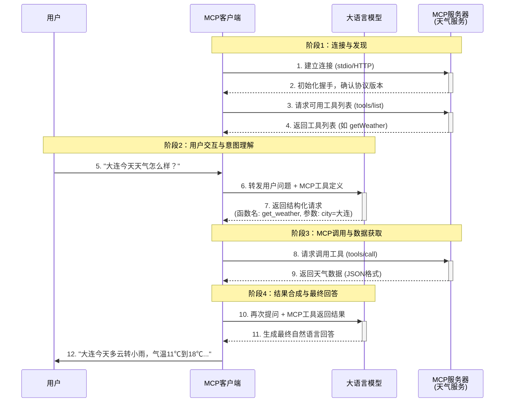
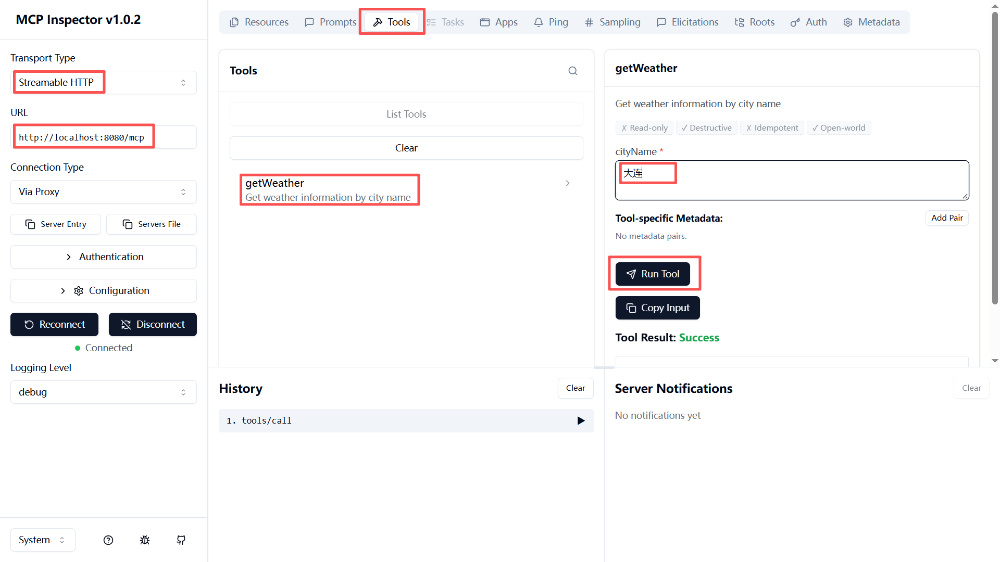

# 构建 MCP 服务端与客户端

## MCP 是什么？

MCP 是 Anthropic 公司推出的 "模型上下文协议"（Model Context Protocol），定义了大语言模型（LLM）与外部世界连接的开放标准，是构建在模型原生 tools（Function Calling）能力之上的一层编排与抽象层。

tools 只解决了 "让模型能输出函数名和参数" 这一个问题，MCP 解决的是：这些函数从哪来？（多个服务、动态安装），如何安全地调用？（权限、沙箱），如何传输大数据？（分块、流式），如何支持非函数类需求？（读取资源、获取提示模板）。

当模型 API 不支持原生的 tools 参数时，客户端会将工具描述拼接到系统提示词中作为降级方案。在目前生态中，由于并非所有模型都支持 function calling，这种拼接方式仍被广泛使用，是一种兼容性很强的落地手段。

## MCP 工作流程



## 项目介绍

基于 Spring AI 实现的 MCP Server，使用 Streamable HTTP 协议，提供天气查询工具服务。

### 技术栈

- Spring Boot 4.0.4
- Spring AI 2.0.1
- MCP Streamable HTTP 协议

### 构建与启动

```bash
mvn spring-boot:run
```

服务启动后监听 `http://localhost:8080`，MCP 端点为 `/mcp`。

### 测试

#### 方式一：MCP Inspector（推荐）

```bash
npx @modelcontextprotocol/inspector
```

启动后在界面中选择 **Streamable HTTP** 传输方式，输入 URL `http://localhost:8080/mcp`，点击 Connect 即可连接测试。



#### 方式二：curl 命令行调试

注意：curl 默认不显示响应头，必须加 `-i` 参数才能看到 `Mcp-Session-Id`。

**第 1 步：初始化连接，获取 Mcp-Session-Id**

```bash
curl -i -X POST http://localhost:8080/mcp \
  -H "Content-Type: application/json" \
  -H "Accept: text/event-stream, application/json" \
  -d '{
    "jsonrpc": "2.0",
    "id": 1,
    "method": "initialize",
    "params": {
      "protocolVersion": "2025-11-25",
      "capabilities": {},
      "clientInfo": {
        "name": "test-client",
        "version": "1.0.0"
      }
    }
  }'
```

响应头中会返回 `Mcp-Session-Id: xxxxxxxx-xxxx-xxxx-xxxx-xxxxxxxxxxxx`，记录该值用于后续请求。

**第 2 步：列出所有可用工具**

```bash
curl -X POST http://localhost:8080/mcp \
  -H "Content-Type: application/json" \
  -H "Accept: text/event-stream, application/json" \
  -H "Mcp-Session-Id: 上一步获取的SessionId" \
  -d '{
    "jsonrpc": "2.0",
    "id": 2,
    "method": "tools/list"
  }'
```

**第 3 步：调用 getWeather 工具**

```bash
curl -X POST http://localhost:8080/mcp \
  -H "Content-Type: application/json" \
  -H "Accept: text/event-stream, application/json" \
  -H "Mcp-Session-Id: 上一步获取的SessionId" \
  -d '{
    "jsonrpc": "2.0",
    "id": 3,
    "method": "tools/call",
    "params": {
      "name": "getWeather",
      "arguments": {
        "cityName": "大连"
      }
    }
  }'
```

#### 方式三：test.http 文件

1. 安装 VS Code 插件 [REST Client](https://marketplace.visualstudio.com/items?itemName=humao.rest-client)
2. 打开 `test.http`，点击请求上方的 **Send Request**
3. 执行第 1 步（initialize）后，响应头中的 `Mcp-Session-Id` 会通过 `{{initialize.response.headers.Mcp-Session-Id}}` 自动传递给后续请求，无需手动粘贴