# Spring Authorization Server 1.4.1

- spring-security-oauth2-authorization-server已迁移至 Spring Security 7.0

- 1.5.x 分支将在 2026 年 6 月停止维护

## 设备授权码模式

从官方文档[RFC8628](https://www.rfc-editor.org/rfc/rfc8628.html)中截取流程图如下：

```
      +----------+                                +----------------+
      |          |>---(A)-- Client Identifier --->|                |
      |          |                                |                |
      |          |<---(B)-- Device Code,      ---<|                |
      |          |          User Code,            |                |
      |  Device  |          & Verification URI    |                |
      |  Client  |                                |                |
      |          |  [polling]                     |                |
      |          |>---(E)-- Device Code       --->|                |
      |          |          & Client Identifier   |                |
      |          |                                |  Authorization |
      |          |<---(F)-- Access Token      ---<|     Server     |
      +----------+   (& Optional Refresh Token)   |                |
            v                                     |                |
            :                                     |                |
           (C) User Code & Verification URI       |                |
            :                                     |                |
            v                                     |                |
      +----------+                                |                |
      | End User |                                |                |
      |    at    |<---(D)-- End user reviews  --->|                |
      |  Browser |          authorization request |                |
      +----------+                                +----------------+

                 Figure 1: Device Authorization Flow
```

- A步骤：设备客户端向认证服务器（/oauth2/device_authorization）发起授权访问，这时候会带上客户端信息
- B步骤：授权服务器会给设备客户端返回设备码、用户码及验证的URI
- C步骤：设备客户端会让用户需要在另一设备（比如智能手机）进行访问验证的URI
- D步骤：用户根据验证的URI在另一台设备（比如智能手机）打开页面，输入用户码，并确认授权；这是会向授权服务器发起认证请求
- E步骤：设备客户端在完成C步骤之后，就开始轮询的方式向授权服务器获取令牌信息。这时候会带上客户端信息和设备码
- F步骤：授权服务器收到设备客户端使用设备码获取令牌信息的请求后，检查D步骤是否已提交授权确认，如果已提交授权确认，则返回令牌信息


### 请求流程

请求/oauth2/device_authorization，配置Authorization和Body

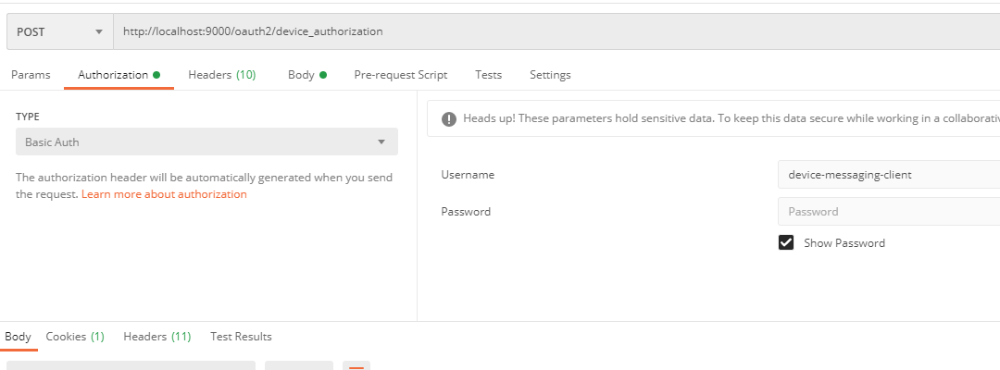
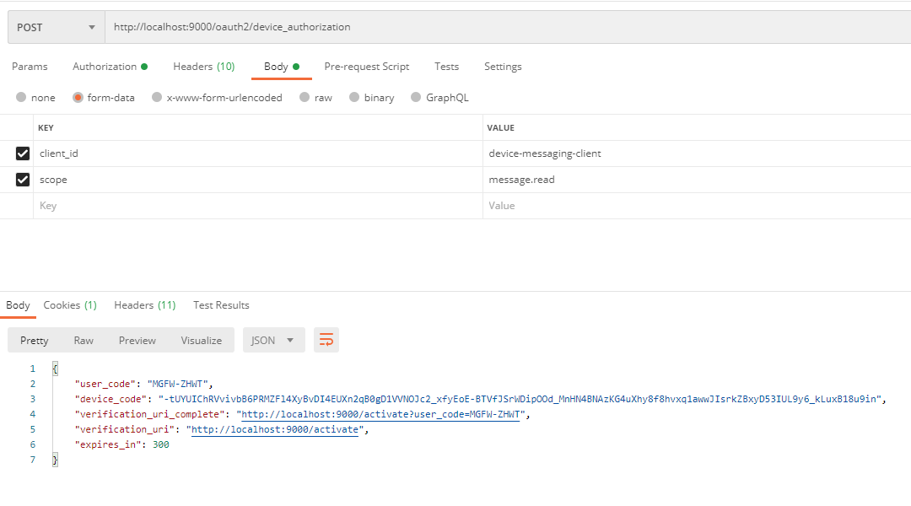

从上面返回的数据中，把verification_uri_complete的完整URI通过浏览器确认授权，这时候需要登录，然后进入授权界面，点击确认

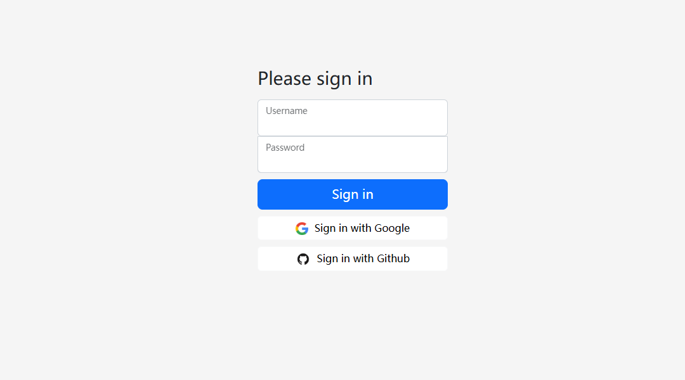
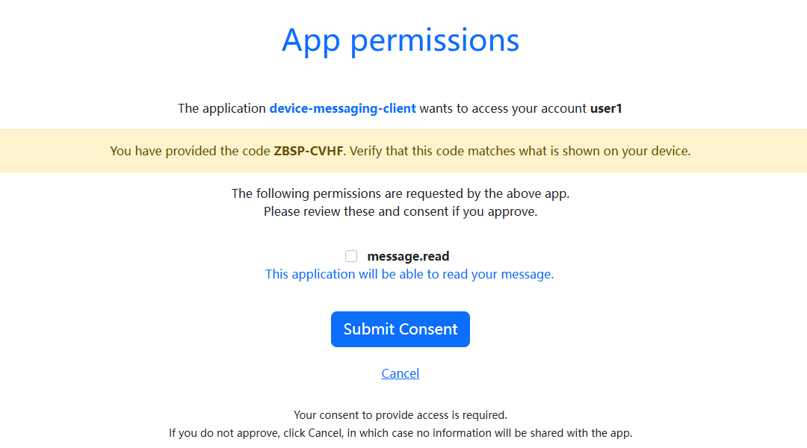
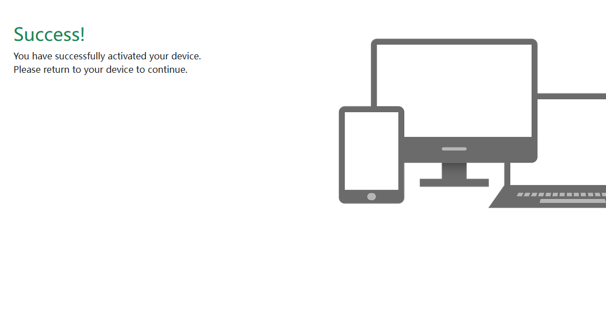
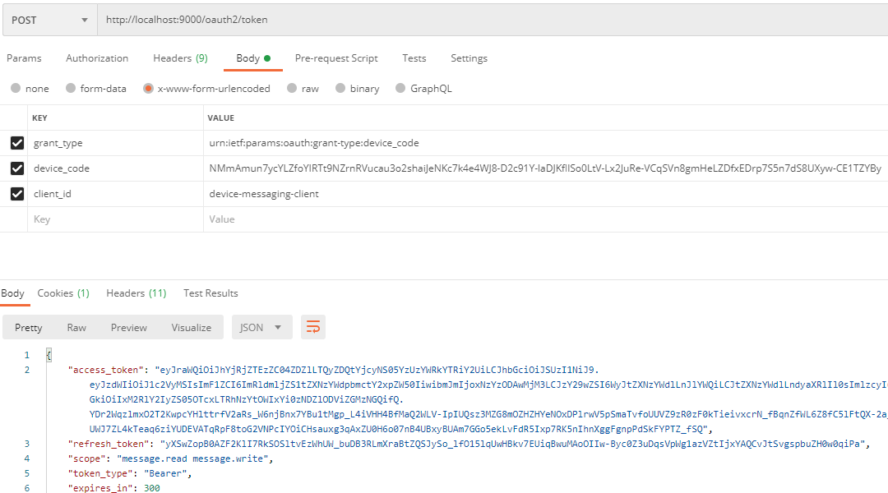

### 核心接口

#### `/oauth2/device_authorization`过滤器

OAuth2DeviceAuthorizationEndpointFilter

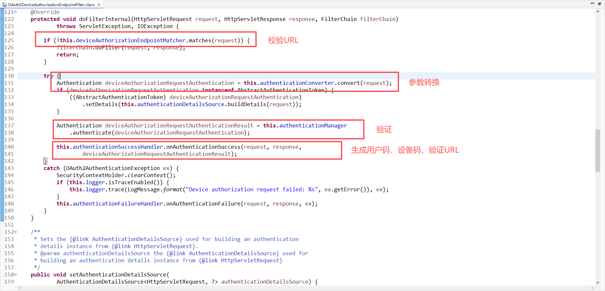

其中authenticationManager是调用`OAuth2DeviceAuthorizationRequestAuthenticationProvider`


`OAuth2DeviceAuthorizationEndpointFilter`最后通过authenticationSuccessHandler进行返回信息

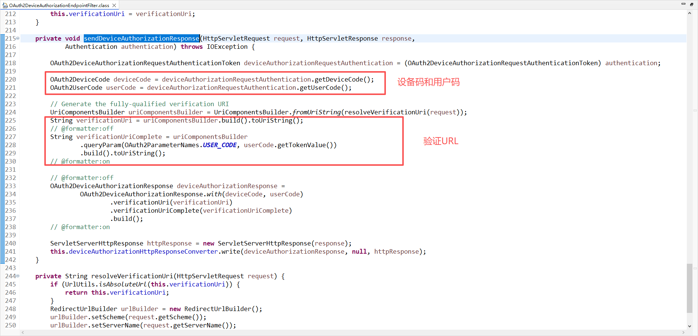

#### `/oauth2/device_verification`过滤器

OAuth2DeviceVerificationEndpointFilter

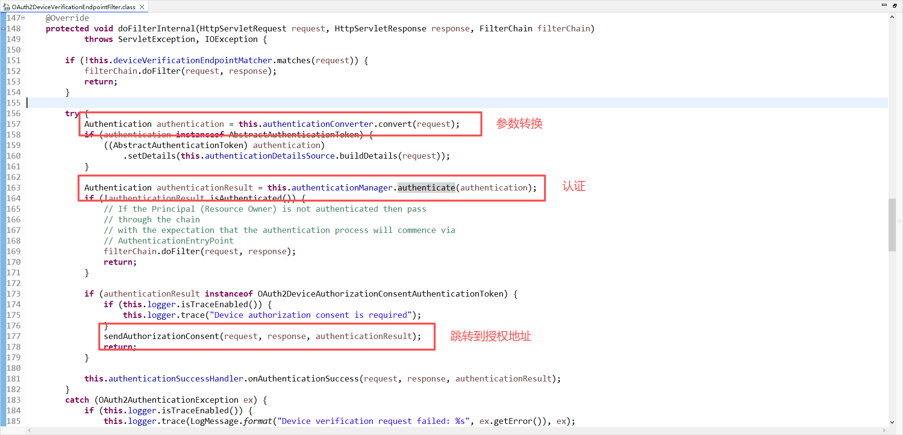

#### `/oauth2/token`过滤器

OAuth2TokenEndpointFilter -> OAuth2DeviceCodeAuthenticationProvider

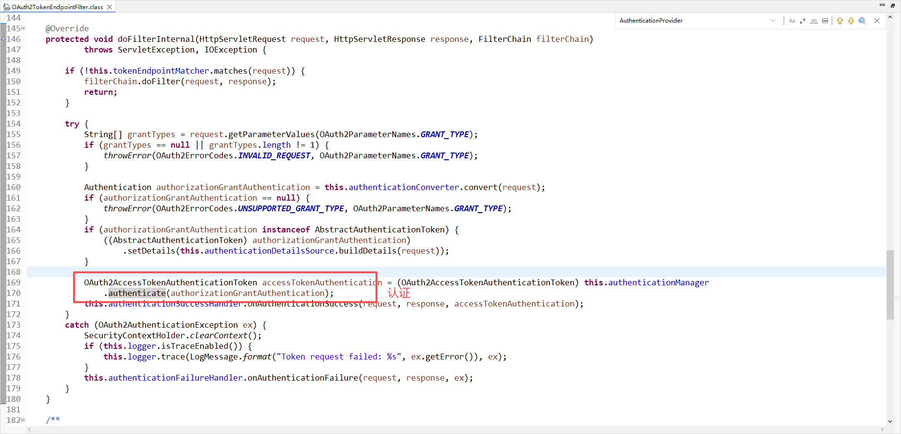

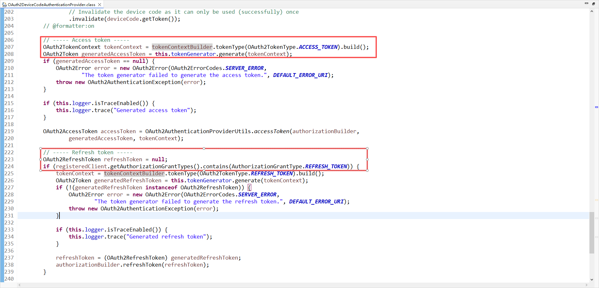

## 三方登录

### GitHub 

#### 集成方式选择

GitHub Apps

- **适用场景**：为自动化任务构建集成
- **典型用途**：CI/CD、代码质量、项目管理工具
- **优势特点**：更安全、更灵活，是现代 GitHub 集成的推荐方式

OAuth Apps

- **适用场景**：
  - 需要用户使用 GitHub 身份登录你的服务
  - 需要代表用户执行个人操作


#### 创建应用

1. 在 GitHub 任意页面的右上角，单击你的个人资料照片，然后单击 `Settings`。

2. 在左边栏中，单击 `Developer Settings`。

3. 在左侧边栏中，单击 `OAuth Apps`。

4. 单击`New OAuth app`新建应用。

5. 在`Application name`中，输入应用程序的名称。

6. 在`Homepage URL`中，输入应用程序网站的完整 URL。

7. 在`Application description`中，输入用户将看到的应用程序说明。

8. 在`Authorization callback URL`中，输入应用程序的回调 URL。（测试地址：http://localhost:9000/login/oauth2/code/github-idp）

   > 与 GitHub Apps 不同，OAuth Apps 不能有多个回调 URL。

9. 如果 OAuth App 将使用设备流来识别和授权用户，请单击` Enable Device Flow`启用设备流。

10. 创建成功会跳转到详情页面，复制`Client ID`
11. 点击`Generate a new client secret`生成`Client secrets`


### Google

